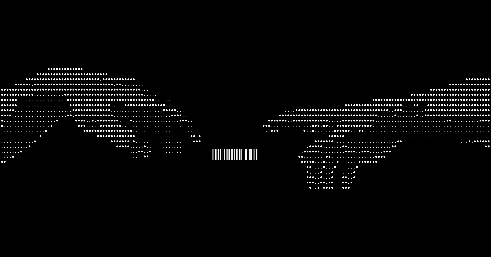

# 🌟 Portfolio

> A modern, responsive developer portfolio built with Next.js and TypeScript

<div align="center">
  
</div>

## ✨ Features

- 🎨 **Modern Design** - Clean, minimalist UI with dark/light mode
- 📱 **Fully Responsive** - Perfect on all devices
- ⚡ **Fast Performance** - Built with Next.js 14
- 🎭 **Interactive Elements** - Smooth animations and hover effects
- 🐱 **Fun Details** - Animated cat companion and custom cursor

## 🛠️ Tech Stack

- **Framework:** Next.js 14 (App Router)
- **Language:** TypeScript
- **Styling:** Tailwind CSS + shadcn/ui
- **Animations:** Framer Motion + Lottie
- **Icons:** Lucide React

## 🚀 Getting Started

```bash
# Clone the repository
git clone https://github.com/mohitooo28/Portfolio

# Install dependencies
npm install

# Start development server
npm run dev
```

Open [http://localhost:3000](http://localhost:3000) to view it in your browser.

## 📦 Available Scripts

```bash
npm run dev      # Start development server
npm run build    # Build for production
npm run start    # Start production server
npm run lint     # Run ESLint
```

## 🎯 Project Structure

```
src/
├── app/          # Next.js app router pages
├── components/   # Reusable UI components
├── data/         # Resume and project data
└── lib/          # Utility functions
```

---
